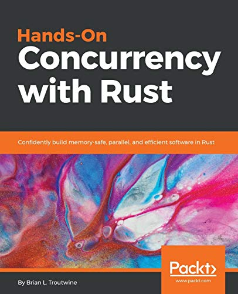

  <a href="https://github.com/prime73num" target="_blank">
     
  </a>
  Rust project home page.

# Rust project home page.

<!-- vim-markdown-toc GFM -->

* [Hands on Concurrency with Rust](#hands-on-concurrency-with-rust)
* [Rust Design Patterns.](#rust-design-patterns)
* [Hands on Data Structure and Algorithm with Rust.](#hands-on-data-structure-and-algorithm-with-rust)
* [Creative Projects for Rust.](#creative-projects-for-rust)

<!-- vim-markdown-toc -->

## Hands on Concurrency with Rust

<a href="./asset/source/Concurrency_rust.pdf" target="_blank">
 
</a>
Rust Concurrency

学习Rust并发编程。

## Rust Design Patterns.

## Hands on Data Structure and Algorithm with Rust.

## Creative Projects for Rust.
